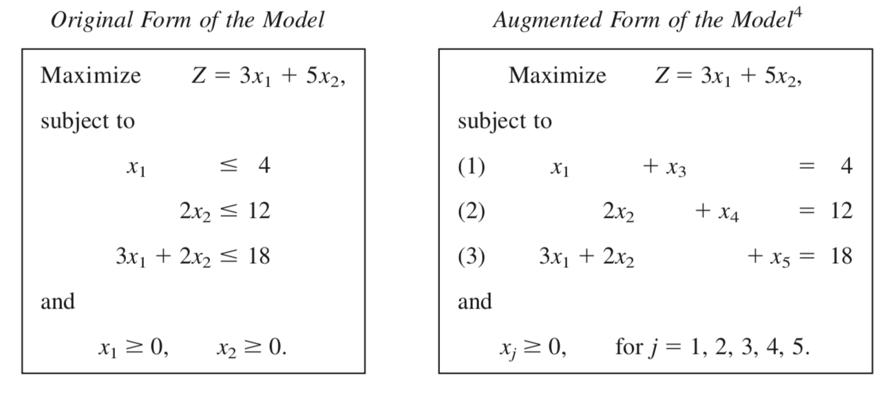
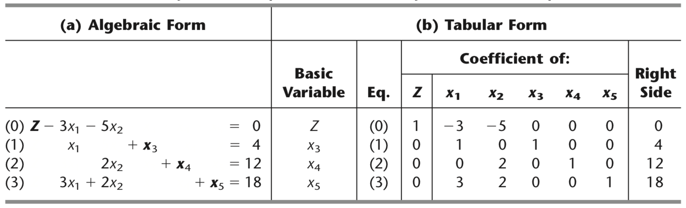
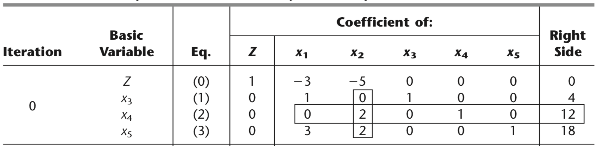
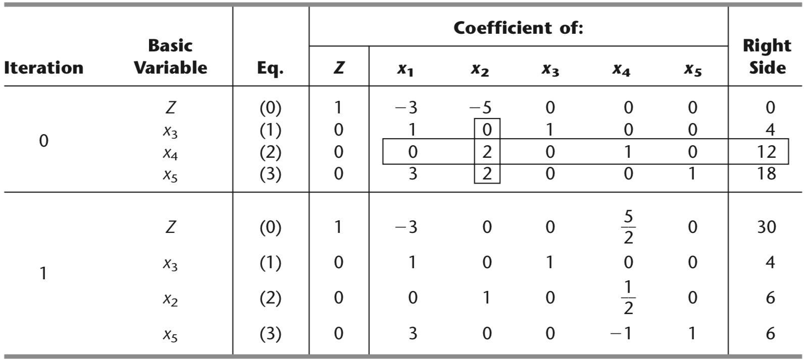
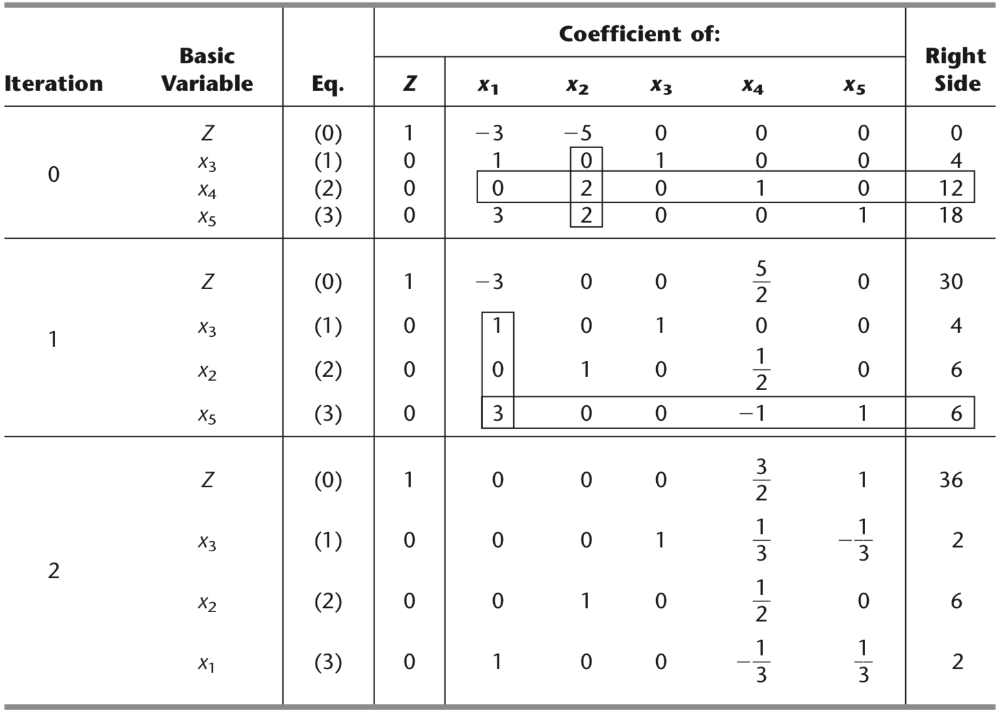

# Simplex Method

- Developed by George Dantzig in 1947
- Is an algebraic procedure where the underlying concepts are geometric, e.g *going from one vertix to the next one*
- Based on solving systems of equations
    - Convert inequality constraints to equality (**slack variables**)
    


**Obs**: from *Introduction to Operations Research, 10th Ed., Hillier & Lieberman*

---
## Simplex Method in Tabular form   

- One of the many procedures to solve a Linear Programming problem with Simplex *by hand*



---
## Summary of method

1. **Initialization**: slack variables + decision variables nonbasic
2. **Optimality test**: if all coefficients in Eq. (0) are nonnegative, otherwise
3. **Iteration**: 
    - Step 1: Determine the *entering basic* variable (the "most negative" coefficient) in Eq. (0). Enclose the colum below this coefficient ("pivot column")
    - Step 2: Determine the *leaving basic* variable (min. ratio test)
        - Pick each coefficient in the pivot column that is $>0$
        - Divide each right side by these coefficients
        - Identify the row with the smallest ratio
        - Replace the leaving basic variable for the entering basic (next simplex tableau)
    - Step 3: Solve for the new system by using elementary row operations

---
## Example
### Iteration 0


---
### Iteration 1


---
### Iteration 2


---
## Problem 1

Consider the following LP

$$\begin{align*}
Max\quad &Z = 3x_1+5x_2+6x_3 \\
s.t&\\
&2x_1+x_2+x_3\le 4 \\
& x_1+2x_2+x_3 \le 4\\
&x_1+x_2+2x_3 \le 4\\
&x_1+x_2+x_3\le 3\\
& x_1,x_2,x_3\ge0\end{align*}$$

1. Work through the Simplex method in tabular form
2. Solve the problem using GAMS and reading the constraints from the file "table_const.csv". Also, write the results into "results.txt"

**Hint** Use the following command
```
Table data(j,i) 
$ondelim
$include table_const.csv
$offdelim
;
```
---
## Problem 2
Consider now

$$\begin{align*}
Max\quad &Z = 3x_1+x_2\\
s.t&\\
&x_1+x_2 \ge 1 \\
& 2x_1+4x_2 \le 10\\
& x_1,x_2\ge0\end{align*}$$

1. Work through the Simplex method in tabular form (watch the first constraint)

### Augmented problem
$$\begin{align*}
Max\quad &Z = 3x_1+x_2-M\bar{x}_5\\
s.t&\\
&x_1+x_2 - x_3 + \bar{x}_5  = 1 \\
& 2x_1+4x_2 + x_4 = 10\\
& x_1,x_2, x_3, \bar{x}_5, x_4 \ge0\end{align*}$$

---
## Solve by two phase Simplex method

1. Solve for $Max \quad Z = -\bar{x}_5$ (obtain a feasible initial solution)
2. Solve for $Max \quad Z = 3x_1+x_2$

---
## Additional resources

- [Data Exchange with Other Applications in GAMS](https://www.gams.com/latest/docs/UG_DataExchange.html)
- [Online Simplex Tableau](http://www.phpsimplex.com/simplex/simplex.htm?l=en)
- Simplex method and Tableau form in Chapter 4, Hillier & Lieberman. 